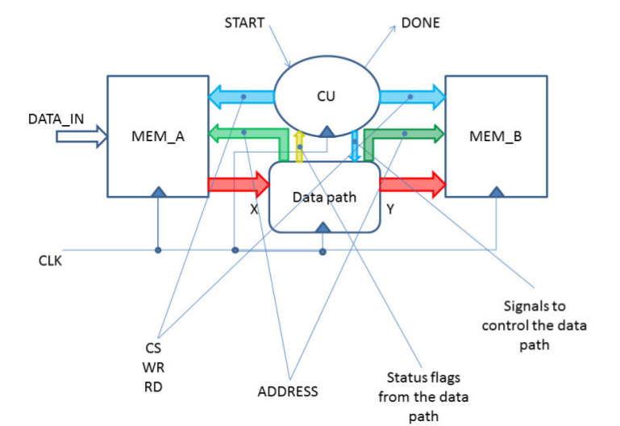
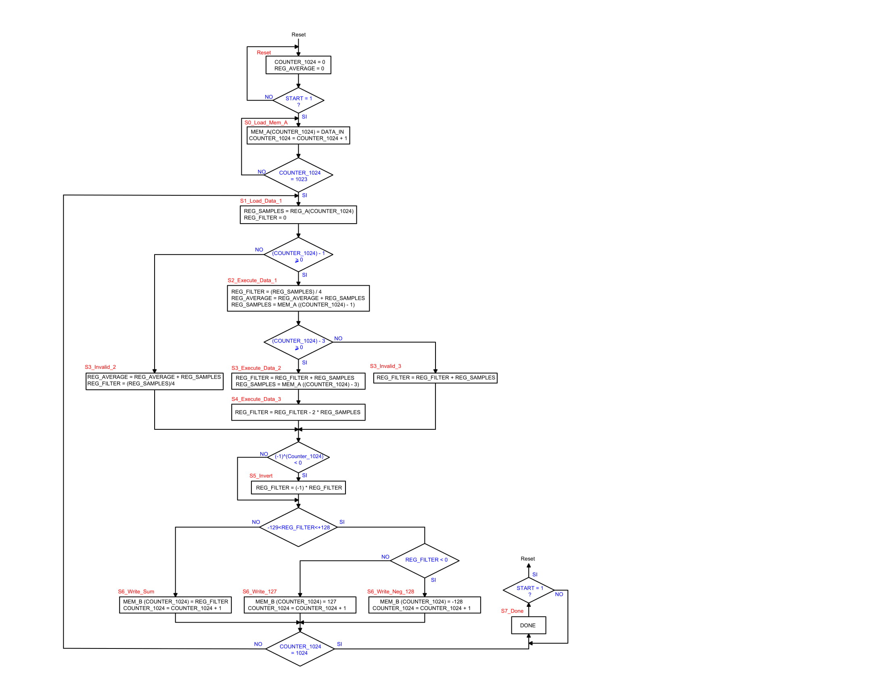

This project has been developed at Politecnico di Torino by:
 - Andrea TRUFINI    (LINKEDIN: https://www.linkedin.com/in/andrea-trufini-15471899/)
 - Christian FABIANO (LINKEDIN: https://www.linkedin.com/in/christian-fabiano-k09/)
 - Elia RIBALDONE    (LINKEDIN: https://www.linkedin.com/in/eliaribaldone/)

# Digital Filter

This is my first project on digital systems.

The project consists on a digital filter able to take data from a memory *MEM_A*, perform operations and save the results in a memory *MEM_B*.
The operation performed on the data is described by the following expression:
<p align="center"></p>

The general top view scheme is the following one:
<p align="center"></p>

In the following there is a brief description of the project organized in different sections:
- Pseudocode
- Datapath
- ASM Chart
- ASM of controls
- Timing
- VHDL
- Testbench

## Pseudocode
In the following there is a MATLAB pseudocode which describes the algorithm to be implemented:
```
%Inizializzazione registri
CNT_1024 = 0
REG_AVERAGE = 0

%Caricamento memoria
for CNT_1024 = 0:1023 %NOTA: l'incremento del contatore viene fatto in modo automatico
    MEM_A(CNT_1024, 1:8) = DATA_IN
    CNT_1024 = CNT_1024 + 1
end

%Scrittura dati in MEM_B
for CNT_1024 = 0:1023
    REG_FILTER = 0 %Reset somma
    REG_SAMPLES = MEM_A(CNT_1024, 1:8) %Read primo dato
    
    REG_FILTER = REG_SAMPLES/4; %Prima operazione
    REG_AVERAGE = REG_AVERAGE + REG_SAMPLES %Accumulo per media
    
    if(CNT_1024 - 1 >= 0)
        REG_SAMPLES = MEM_A(CNT_1024 - 1, 1:8) %Read secondo dato
        REG_FILTER = REG_FILTER + REG_SAMPLES %Seconda operazione
        if(CNT_1024 - 3 >= 0)
            REG_SAMPLES = MEM_A(CNT_1024 - 3, 1:8) %Read terzo dato
            REG_FILTER = REG_FILTER - 2*REG_SAMPLES %Terza operazione
        end
    end
    
    if((-1)^CNT_1014 < 0)
        REG_FILTER = -REG_FILTER %Inversione ogni 2 cicli
    end
    
    if(-128 <= REG_FILTER <= 127) %"Overflow" del dato
        MEM_B(CNT_1024, 1:8) = REG_FILTER
    elseif (REG_FILTER < 0)
        MEM_B(CNT_1024, 1:8) = -128
    else
        MEM_B(CNT_1024, 1:8) = 127
    end
end

REG_AVERAGE = REG_AVERAGE / 1024 %Divisione media
```

## Data path

<p align="center"></p>

## ASM Chart

<p align="center"></p>


